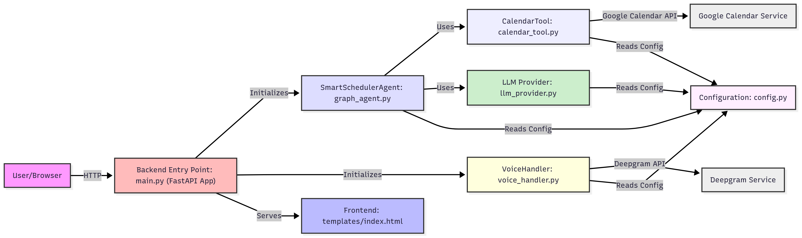

# Smart Scheduler AI Agent

A smart meeting scheduling assistant that uses AI to understand natural language requests and manage your calendar. The application features voice input, text-to-speech responses, and intelligent calendar management.

Check out the video here.
https://www.loom.com/share/5dca2e517e744bdca5b7a43f540efc68?sid=5394df23-ab1d-48db-9aee-ee20f9b8e3d2

## Features

- 🤖 AI-powered natural language processing for scheduling requests (LangGraph with Gemini)
- 🎤 Voice input support with real-time speech recognition
- 🔊 Text-to-speech responses using Deepgram TTS
- 📅 Google Calendar integration for managing meetings
- 💬 Interactive chat interface with real-time updates via WebSockets
- 📱 Responsive design for both desktop and mobile
- 🔄 Automatic timezone handling (IST/UTC)

## Codebase Structure

This project is organized to separate concerns, making it modular and easier to understand. The application's core logic and API endpoints are managed by `main.py`.

Here's a high-level overview of the architecture:





**Explanation of Components:**

*   **User/Browser:** The end-user interacting with the web application through their browser.
*   **Frontend (`templates/index.html`):** The client-side HTML, CSS, and JavaScript that provides the chat interface, microphone input, and displays responses. It communicates with the backend via HTTP API calls (for chat, booking, TTS, STT) and serves the main interface.
*   **Backend Entry Point (`main.py`):** This is the central FastAPI application file. It sets up the web server, defines API endpoints (for chat, booking, speech-to-text, text-to-speech, calendar, and OAuth), and initializes the `SmartSchedulerAgent` and `VoiceHandler`. This file orchestrates the overall application flow.
*   **SmartSchedulerAgent (`graph_agent.py`):** The core AI agent built with LangGraph. It manages the conversational state, invokes various tools (like `CalendarTool`), and uses an LLM to decide the next action based on user input and conversation context. This is where the intelligent decision-making and workflow orchestration happen.
*   **CalendarTool (`calendar_tool.py`):** A custom tool specifically designed for Google Calendar interactions. It handles authentication with Google Calendar API, finding available time slots, creating new meetings, and retrieving existing events. It abstracts away the complexities of the Google Calendar API from the agent.
*   **LLM Provider (`llm_provider.py`):** A utility module responsible for initializing and providing the Language Model (LLM) instances, such as Google Gemini or Groq, based on the application's configuration. It ensures that the `SmartSchedulerAgent` has access to the appropriate LLM.
*   **VoiceHandler (`voice_handler.py`):** Manages all speech-related functionalities, including converting speech-to-text (STT) and text-to-speech (TTS) using the Deepgram API. It provides a convenient interface for the backend to handle audio inputs and outputs.
*   **Configuration (`config.py`):** Stores all environment-dependent settings and API keys, such as Google API keys, Deepgram API key, Google Calendar scopes, and server host/port. This centralizes configuration and keeps sensitive information out of the main codebase.
*   **Deepgram Service:** The external Deepgram API, utilized by the `VoiceHandler` for high-quality speech-to-text (STT) and text-to-speech (TTS) functionalities.
*   **Google Calendar Service:** The external Google Calendar API for managing calendar events, used by the `CalendarTool`.

This modular structure ensures a clear separation of concerns, making the codebase more maintainable, scalable, and easier to understand for developers. The LangGraph framework within `graph_agent.py` effectively manages the complex conversational state and orchestrates the execution of different components based on the user's needs.

## Prerequisites

- Python 3.8 or higher
- Google Cloud Platform account with Calendar API enabled
- Google Gemini API key
- Deepgram API key
- Modern web browser with microphone support

## Setup Instructions

1. **Clone the repository**
   ```bash
   git clone <repository-url>
   cd nextdimention
   ```

2. **Create and activate a virtual environment**
   ```bash
   # Windows
   python -m venv venv
   .\venv\Scripts\activate

   # macOS/Linux
   python3 -m venv venv
   source venv/bin/activate
   ```

3. **Install dependencies**
   ```bash
   pip install -r requirements.txt
   ```

4. **Set up environment variables**
   - Create a `.env` file in the root directory of your project.
   - Fill in your API keys and credentials in the `.env` file. You can use `.env.example` as a template (if provided):
     - `GOOGLE_API_KEY`: Your Google Gemini API key
     - `DEEPGRAM_API_KEY`: Your Deepgram API key
     - `GOOGLE_CLIENT_ID`: Google OAuth Client ID for Calendar API
     - `GOOGLE_CLIENT_SECRET`: Google OAuth Client Secret for Calendar API
     - `REDIRECT_URI`: Should be `http://localhost:5000/oauth2callback` for local development
     - `LLM_PROVIDER`: (Optional) `gemini` (default) or `groq` if you want to use Groq LLMs.
     - `GROQ_API_KEY`: Your Groq API key (only if `LLM_PROVIDER` is set to `groq`)

5. **Configure Google Calendar API**
   - Go to [Google Cloud Console](https://console.cloud.google.com)
   - Create a new project or select an existing one
   - Enable the Google Calendar API
   - Create OAuth 2.0 Client ID credentials (Web application type)
   - Add `http://localhost:5000/oauth2callback` as an authorized redirect URI
   - Make sure your `GOOGLE_CLIENT_ID` and `GOOGLE_CLIENT_SECRET` are correctly added to your `.env` file.

## Running the Application

1. **Start the FastAPI server**
   From the root directory of your project, run:
   ```bash
   python main.py
   ```

2. **Access the application**
   - Open your browser and go to `http://localhost:5000`
   - On first use, you will be prompted to authenticate with Google Calendar via your browser.

## Usage

1. **Scheduling a Meeting**
   - Type or speak your scheduling request (e.g., "Schedule a 1-hour meeting tomorrow afternoon")
   - The AI will parse your request and check calendar availability
   - Select from available time slots (if prompted)
   - Confirm the meeting details

2. **Voice Commands**
   - Click and hold the microphone button to start recording
   - Speak your request clearly
   - Release the button to send your request

3. **Quick Actions**
   - Use the quick action buttons for common scheduling requests

## Troubleshooting

1. **Google Calendar Authentication Issues**
   - Ensure your OAuth credentials are correctly configured in `.env`.
   - Verify that `http://localhost:5000/oauth2callback` is listed as an authorized redirect URI in your Google Cloud Console.
   - Check network connectivity and API quotas.

2. **Voice Recognition/TTS Problems (Deepgram)**
   - Check microphone permissions in your browser.
   - Ensure your `DEEPGRAM_API_KEY` is correct in `.env`.
   - Check Deepgram API status and usage limits.

3. **General API Key Issues**
   - Verify all API keys (`GOOGLE_API_KEY`, `DEEPGRAM_API_KEY`, `GOOGLE_CLIENT_ID`, `GOOGLE_CLIENT_SECRET`, `GROQ_API_KEY` if used) are correctly set in `.env`.
   - Check API key quotas and limits for Gemini, Groq, and Deepgram.

4. **Module Not Found Errors**
   - Ensure you are running `python main.py` from the project root directory as specified in "Running the Application".
   - Confirm all dependencies are installed via `pip install -r requirements.txt`.

## Contributing

1. Fork the repository
2. Create a feature branch
3. Commit your changes
4. Push to the branch
5. Create a Pull Request

## License

This project is licensed under the MIT License - see the LICENSE file for details.

## Acknowledgments

- Google Calendar API
- Google Gemini AI
- Deepgram (for Speech-to-Text and Text-to-Speech)
- FastAPI Framework
- LangChain & LangGraph
- Groq (optional LLM provider)
